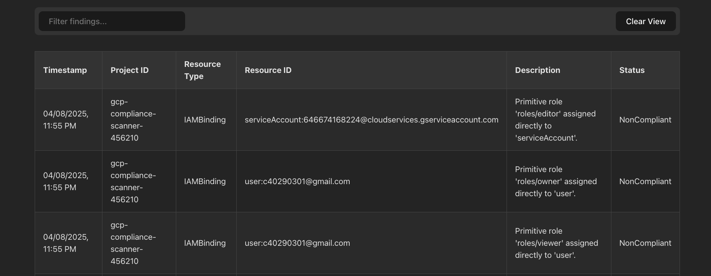

# GCP Compliance Scanner


**A web application designed to improve Google Cloud security posture by automatically scanning GCP projects for common, high-risk security misconfigurations and displaying the findings.**

## Motivation & Purpose

Cloud environments offer immense flexibility but can quickly become complex. Manually verifying security configurations across numerous resources (storage buckets, virtual machines, firewall rules, IAM policies) is tedious, error-prone, and often insufficient to catch misconfigurations before they become security risks. Common issues like publicly exposed data, overly permissive access, or insecure network settings can lead to significant security incidents.

This GCP Compliance Scanner aims to address these challenges by:

*   **Automating Checks:** Programmatically scanning for a predefined set of common security best-practice violations.
*   **Providing Visibility:** Offering a simple web interface to trigger scans and view historical findings stored in a database.
*   **Improving Efficiency:** Saving time and effort compared to manual checks.
*   **Enhancing Security Posture:** Enabling faster identification and remediation of potential vulnerabilities.
*   **Demonstrating Cloud Security Skills:** Serving as a practical example of using cloud APIs, automation, and secure development practices (including secure deployment patterns) within GCP.

## Features / Checks Implemented

The scanner currently checks for the following potential misconfigurations:

*   **Cloud Storage:**
    *   Publicly accessible buckets (`allUsers` or `allAuthenticatedUsers`).
    *   Access logging disabled.
*   **Networking:**
    *   Firewall rules allowing ingress from any source (`0.0.0.0/0`) on sensitive ports (SSH/22, RDP/3389).
    *   Unassociated static external IP addresses.
*   **IAM:**
    *   Assignment of primitive roles (Owner, Editor, Viewer) directly to users or non-default service accounts at the project level.
*   **Compute Engine:**
    *   Instances using the default Compute Engine service account.
    *   Unattached persistent disks.

*(See `backend/scanner/checks.py` for implementation details)*

## Technology Stack

*   **Backend:**
    *   Language: Python 3.9+
    *   Framework: FastAPI
    *   Database ORM: SQLAlchemy
    *   GCP Interaction: `google-cloud-python` client libraries (`storage`, `compute`, `resourcemanager`, `sql-connector`)
    *   Database Driver: `pg8000`
    *   Deployment: Docker, Gunicorn, Cloud Run
*   **Frontend:**
    *   Language: TypeScript
    *   Framework: React (with Vite)
    *   Styling: CSS Modules / Plain CSS
    *   Date Formatting: `date-fns`
    *   Deployment: Firebase Hosting
*   **Database:**
    *   Cloud SQL for PostgreSQL
*   **Cloud Platform:**
    *   Google Cloud Platform (GCP)
*   **Infrastructure & Deployment:**
    *   Artifact Registry (for Docker images)
    *   Secret Manager (for database password)
    *   Firebase CLI, gcloud CLI, Docker CLI

## Screenshots


**Main Interface:**


**Example Findings:**


## Prerequisites

*   **Google Cloud Account:** With billing enabled.
*   **GCP Project:** A project to host the Cloud SQL instance and potentially the deployed application.
*   **Google Cloud SDK (`gcloud`):** Installed and initialized locally ([Install Guide](https://cloud.google.com/sdk/docs/install)).
*   **Python:** Version 3.9+
*   **Node.js:** Version 18+ (includes npm)
*   **Git:** For cloning the repository.
*   **Docker:** Installed locally ([Install Guide](https://docs.docker.com/get-docker/)).
*   **Firebase CLI:** Installed globally (`npm install -g firebase-tools`) and logged in (`firebase login`).

## GCP Setup (One-Time)

These steps configure the necessary GCP resources. Run these `gcloud` commands locally or in Cloud Shell.

1.  **Login & Set Project:**
    ```bash
    gcloud auth login
    gcloud config set project YOUR_GCP_PROJECT_ID # Replace with your project ID
    ```

2.  **Enable APIs:**
    ```bash
    gcloud services enable \
      sqladmin.googleapis.com \
      compute.googleapis.com \
      storage.googleapis.com \
      cloudresourcemanager.googleapis.com \
      iam.googleapis.com \
      secretmanager.googleapis.com \
      artifactregistry.googleapis.com \
      run.googleapis.com # Ensure Cloud Run API is enabled
    ```

3.  **Create Cloud SQL Instance (PostgreSQL):**
    ```bash
    # Replace YOUR_ROOT_PASSWORD with a secure password (not used by the app)
    # Adjust region/tier as needed
    gcloud sql instances create compliance-scanner-db \
      --database-version=POSTGRES_15 \
      --tier=db-f1-micro \
      --region=us-central1 \
      --root-password=YOUR_ROOT_PASSWORD
    ```

4.  **Create Database:**
    ```bash
    gcloud sql databases create compliance_data --instance=compliance-scanner-db
    ```

5.  **Create Database User:**
    ```bash
    # Replace YOUR_DB_PASSWORD with a secure password for the app
    gcloud sql users create scanner_user \
      --instance=compliance-scanner-db \
      --password=YOUR_DB_PASSWORD
    ```

6.  **Get Instance Connection Name:** (Needed for `.env` file)
    ```bash
    gcloud sql instances describe compliance-scanner-db --format='value(connectionName)' --project=YOUR_GCP_PROJECT_ID
    # Example output: YOUR_GCP_PROJECT_ID:us-central1:compliance-scanner-db
    ```

7.  **Setup Local ADC:** (Run on your local machine where the backend will run)
    ```bash
    gcloud auth application-default login
    ```
    *(Follow browser prompts. Ensure you log in as the user who will run the scans.)*

8.  **Grant IAM Roles to ADC User:** (Replace `your-email@example.com` with the email used for ADC)
    ```bash
    gcloud projects add-iam-policy-binding YOUR_GCP_PROJECT_ID \
      --member="user:your-email@example.com" \
      --role="roles/cloudsql.client"

    gcloud projects add-iam-policy-binding YOUR_GCP_PROJECT_ID \
      --member="user:your-email@example.com" \
      --role="roles/viewer"

    gcloud projects add-iam-policy-binding YOUR_GCP_PROJECT_ID \
      --member="user:your-email@example.com" \
      --role="roles/storage.admin" # Needed for getIamPolicy/get on buckets
    ```

## Local Development Setup

1.  **Clone the Repository:**
    ```bash
    git clone <repository-url>
    cd gcp-compliance-scanner
    ```

2.  **Backend Setup:**
    *   Navigate to the backend directory: `cd backend`
    *   Create and activate a Python virtual environment:
        ```bash
        python3 -m venv venv
        source venv/bin/activate # macOS/Linux
        # .\venv\Scripts\activate # Windows
        ```
    *   Install dependencies (including the connector from Git):
        ```bash
        pip install --upgrade pip
        pip install git+https://github.com/GoogleCloudPlatform/cloud-sql-python-connector.git
        pip install -r requirements.txt
        ```
    *   Create a `.env` file (`backend/.env`) with your database credentials:
        ```dotenv
        DB_USER=scanner_user
        DB_PASS=YOUR_DB_PASSWORD # The password you set in GCP Setup step 5
        DB_NAME=compliance_data
        INSTANCE_CONNECTION_NAME=YOUR_INSTANCE_CONNECTION_NAME # From GCP Setup step 6
        ```

3.  **Frontend Setup:**
    *   Navigate to the frontend directory: `cd ../frontend` (from backend) or `cd frontend` (from root)
    *   Install dependencies: `npm install`

## Running Locally

You need two terminals open.

1.  **Terminal 1: Run Backend Server:**
    *   Navigate to `backend/`
    *   Activate the virtual environment: `source venv/bin/activate`
    *   Start the server: `uvicorn main:app --reload --port 8080`

2.  **Terminal 2: Run Frontend Server:**
    *   Navigate to `frontend/`
    *   Start the server: `npm run dev`

3.  **Access the Application:** Open your browser to `http://localhost:5173` (or the URL provided by `npm run dev`).

## How to Use

1.  Enter the GCP Project ID you want to scan into the input field.
2.  Select the specific compliance checks you want to run (or leave "All Checks" selected).
3.  Click "Run Compliance Scan".
4.  Wait for the scan to complete (view loading indicators).
5.  View the findings in the table. Use the filter input or click table headers to sort results.
6.  Click "Clear View" to remove findings from the current display (does not delete from database).

## Deployment

See `DEPLOYMENT.md` for instructions on deploying the backend to Cloud Run and the frontend to Firebase Hosting.

## Current Status / Next Steps

*   The application is deployed with public endpoints for demonstration purposes.
*   Future enhancements could include:
    *   Adding user authentication (e.g., Firebase Authentication).
    *   Implementing least-privilege service accounts for the backend.
    *   Adding more compliance checks (e.g., API key restrictions, SA key age, logging configurations).
    *   Refining the UI/UX further (e.g., pagination, advanced filtering).
    *   Implementing automated testing.

